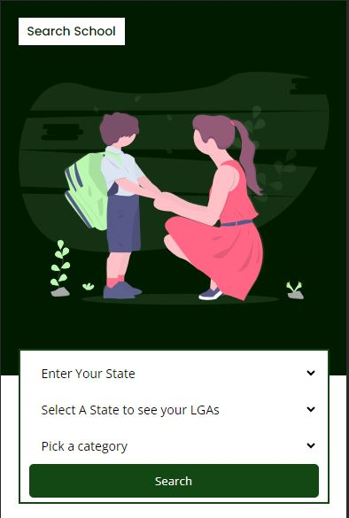

# School Listing Application(Naija School Search)

This web application provides a comprehensive platform for users to discover and explore various schools in Nigeria and in different categories(Daycare to Secondary), making informed decisions about their child's education.

## Table of Contents

- [Features](#features)
- [Technologies](#technologies)
- [Contributing](#contributing)

## Features

- **Listing Application:** School owners can apply for their schools to listed. School owners can create, edit and delete(unlist) their school
- **School Listings:** Browse a wide range of schools, from Daycare to secondary and more.
- **Detailed Information:** Access in-depth details about each school, including location, facilities, and contact information.
- **User Authentication:** Secure registration and login system to personalize your experience. Also secure way to reset forgotten password

## Technologies

This project is built using the MERN (MongoDB, Express, React, Node.js) stack, and several additional technologies and libraries, including:

- **Frontend:**
  - React
  - React context for state management
  - React Router for client-side routing
  - css and material ui for styling

- **Backend:**
  - Node.js with Express.js for API development
  - MongoDB as the database for storing school and user data
  - Mongoose for MongoDB data modeling

- **Additional Libraries:**
  - Axios for HTTP requests
  - JWT for user authentication

# Contributing
We welcome contributions from the community! If you'd like to contribute to this project, please follow these steps:

-Fork the repository.
- Create a new branch for your feature or bug fix: git checkout -b feature/your-feature-name.
- Make your changes and commit them: git commit -m 'Add some feature'.
- Push your changes to your fork: git push origin feature/your-feature-name.
- Create a pull request.
- Please ensure that your pull request includes a clear description of your changes and any relevant information.